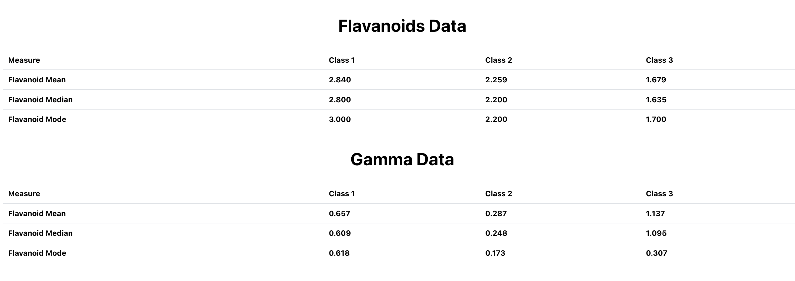

# Manufac

Welcome to Manufac! This README file will guide you on how to install, run, and build the project.

## Installation

1. Clone the repository to your local machine:

   ```bash
   git clone https://github.com/harshitxjaj/manufac

### `yarn install`

Installs the dependencies for the project.

### `yarn start`

Runs the app in the development mode.\
Open http://localhost:3000 to view it in your browser.

The page will reload when you make changes.\
You may also see any lint errors in the console.

### `yarn build`

Builds the app for production to the `build` folder.\
It correctly bundles React in production mode and optimizes the build for the best performance.

The build is minified and the filenames include the hashes.\
Your app is ready to be deployed!

See the deployed version: https://manufac-zeta.vercel.app/




